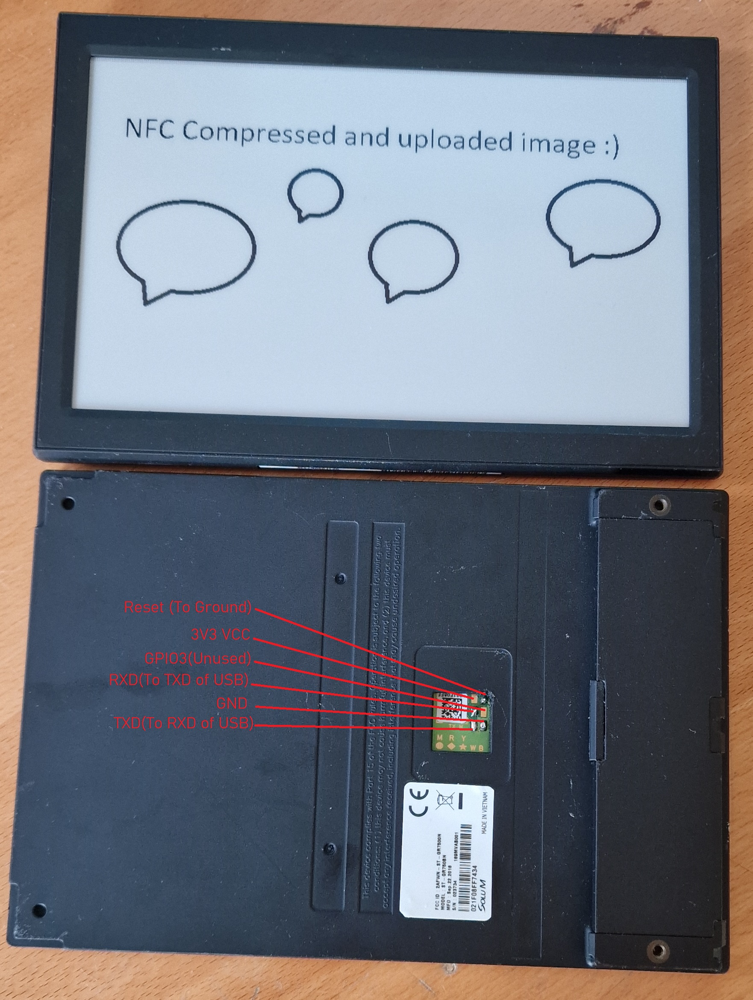

# 88MZ100 Custom Zigbee E-Paper Firmware and Flasher

## By Aaron Christophel <https://ATCnetz.de>

### You can support my work via PayPal: <https://paypal.me/hoverboard1> this keeps projects like this coming

## Overview

In this Repo you can find a custom firmware for the 88MZ100 ARM SOC, this Microcontroller is used in some E-Paper Price tags.

The main usage is to utilize the Internal Zigbee Radio to upload images to the PriceTag via the [E-Paper Station](https://github.com/danielkucera/epaper-station) or any other Compatible station.

This Protocoll and firmware is based on Dmitry's great [work](http://dmitry.gr/?r=05.Projects&proj=29.%20eInk%20Price%20Tags)

Many infos about what all this is even about can be read at the [ZBS_Flasher](https://github.com/atc1441/ZBS_Flasher) Repo as that is basically the same thing just with a different Microcontroller in its core

Currently the following Price tags are supported:

- 7.4" BWR With NFC and Zigbee [7.4_BWR_Firmware_NFC_Compression](7.4_BWR_Firmware_NFC_Compression)

<a href="pictures/74_pinout.jpg"></a>

- 6" BW, Only to enable USB Connection, no Zigbee, precompiled [6_BW_GPIO_Enable_to_use_USB](6_BW_GPIO_Enable_to_use_USB)

<a href="pictures/6_pinout.jpg"></a>

## Compiling

So far the compiling is only tested on windows, to do so you need to install [MinGW](https://sourceforge.net/projects/mingw/) including its modules, after installing it, it is best to add the MinGW folders to the Path enviroment of windows so you can access it from anywhere via the Cmdline.
Go into the Custom firmware folder for your Price tag via a Cmdline and enter "make" to compile and flash, or "make only" to only compile the firmware. The UART Port needs to be changed in the makefile to fit to your UART port of the USB to UART Converter. After compiling the main.bin can be used to flash via UART or UPDT00xx.BIN file can be used to update the Price tag OTA via the [E-Paper Station](https://github.com/danielkucera/epaper-station)

## Flashing

Luckily the 88MZ100 does offer an ROM Based UART Bootloader, this means only an USB to UART Converter is needed to flash one.
Connect the TXD and RXD Wires to the Testpoints of the Price tag. Either Connect the DTR wire of your USB to UART Converter to Reset or use a Button/Tweezer to bridge reset to ground.
Start the 88MZ100 Flashing tool and wait till it prompts you to reset the SOC, the upload will then start.

## MAC Settings

Since the Custom firmware and Station is working on a MAC based identification it is needed to set a custom MAC to your Display.
To do so you can either change a default one in the main.c at "SW_DEFAULT_MAC" before compiling or you can edit the compiled main.bin at an offset of 0x148 (8 following bytes, reversed order) via an HEX Editor Like [HxD](https://mh-nexus.de/en/hxd/).
This set MAC will be used on first Boot by the Firmware to write it at the correct position in flash. Changing it in the OTA file will not change the MAC.

Here is a YouTube video that shows the general function https://youtu.be/DRuVUtqFqcg

[](https://www.youtube.com/watch?v=DRuVUtqFqcg)

Here is a YouTube video that shows the NFC Upload function https://youtu.be/8iCbxLUEIIo

[](https://www.youtube.com/watch?v=8iCbxLUEIIo)

88MZ100 SOC infos:

The 88MZ100 has 512K of internal Flash and 160K of RAM, the ram is split up into Code and Ram usage on boot, so 80K for Firmware and 80K for Data

The Chip is QFN48 and has no open and known datasheet but here is some reversed pinout:
```
1 - OSC 32mhz in
2 - OSC 32mhz out
3 - GPIO 0 - Reset
4 - GPIO 1 - Something NFC Power
5 - GPIO 2 - EPD BS
6 - GPIO 3 - Test mode input
7 - GPIO 4 - UART TXD
8 - GPIO 5 - IO Wakeup
9 - GPIO 6 - UART RXD
10 - GPIO 7 - Something NFC i2c
11 - SOME VDD or VCC
12 - SOME VDD or VCC

13 - Antenna OUT
14 - NC
15 - SOME VDD or VCC
16 - GPIO 8 - 
17 - GPIO 9 - 
18 - GPIO 10 - 
19 - GPIO 11 - 
20 - GPIO 12 - SPI SDO / EPD MoSi
21 - GPIO 13 - SPI SDI
22 - GPIO 14 - SWD CLK
23 - GPIO 15 - SWD DIO
24 - GPIO 16 - 

25 - SOME VDD or VCC
26 - GPIO 17 - 
27 - GPIO 18 - 
28 - GPIO 19 - 
29 - GPIO 20 - 
30 - GPIO 21 - 
31 - GPIO 22 - SPI SCK / EPD Clock
32 - GPIO 23 - EPD CS
33 - GPIO 24 - EPD Reset
34 - GPIO 25 - 
35 - SOME VDD or VCC
36 - SOME VDD or VCC

37 - CF2 Capacitor
38 - CF1 Capacitor
39 - VCC 3.3V maybe VBAT
40 - SOME VDD or VCC
41 - SOME VDD or VCC
42 - SOME VDD or VCC
43 - GPIO 26 - EPD D/C
44 - GPIO 27 - EPD Busy
45 - GPIO 28 - Something NFC i2c
46 - GPIO 29 - Something NFC i2c
47 - GPIO 30 - 
48 - SOME VDD or VCC


UART0 possible GPIOs:
NR= TXD, RXD
0 = 19,20
1 = 2,3
2 = 8,9
3 = 10,11
4 = 24,25
5 = 26,27

UART1 possible GPIOS:
NR= TXD, RXD
0 = 4,6
1 = 6,7
2 = 21,22

GPIO Register

0x48070000 + OFFSET!!! = Gpio function 0=GPIO 6=SPI
0x4A040004 = GPIO mode Input/Output
0x4A040000 = GPIO set/clear
0x4A040050 = GPIO Read

Currently known memory regions:

0x00000000 - 0x0001ffff  ROM 128kb

0x00100000 - 0x00127fff  RAM 160kb <- For code execution
0x20100000 - 0x20127fff Just the same RAM 160kb as on 0x00100000 <- For RAM

0x00000000 - 0x00800000 Internal SPI Flash 512kb <- only acessable via internal QSPI Hardware


Fimrware Header:

Little endian so its switched!

8 times uint32_t

0x20125030 = 00 00 00 00 = CRC if used, or check if flash empty
0x20125034 = FF FF FF FF = CONFIG 1
0x20125038 = 44 C6 00 00 = Length of image counts after header
0x2012503C = FF FF EE FF = CONFIG 2

0x20125040 = FF FF FF FF = Password, if not this then SWD is disabled and UART bootloader needs password to work
0x20125044 = 00 00 10 00 = RAM Loading point 0x100000
0x20125048 = 41 01 10 00 = Entry point 0x100141
0x2012504C = 4C 56 52 4D = Magic string MRVL

CONFIG_1
31:17 = Reserved
16:13 = UART_GPIO 
12:9 = Boot_delay 0=20ms 1=40ms 2=1s 3=2s 4=3s
8 = UART Port 0 or 1
7 = 0=Enable 1=Disable QSPI Prescaler
6:0 = 0-127 * 16 QSPI Prescaler

CONFIG_2
31:24 = BaudRate inversed default 0xFF
23:16 = BaudRate inversed default 0xEE
15:14 = 0-2 * 8 Enable custom Boot delay
13:8 = Reserved
7:6 = Wrong Pass entry till Erase 0 = 0ff 
4:3 = QSPI Mode
2:0 = CRC Check 0=CRC_16_CCITT 1=CRC_16_IBM 2=CRC_16_T10_DIF 3=CRC_32_IEEE 7=NO CRC


```
